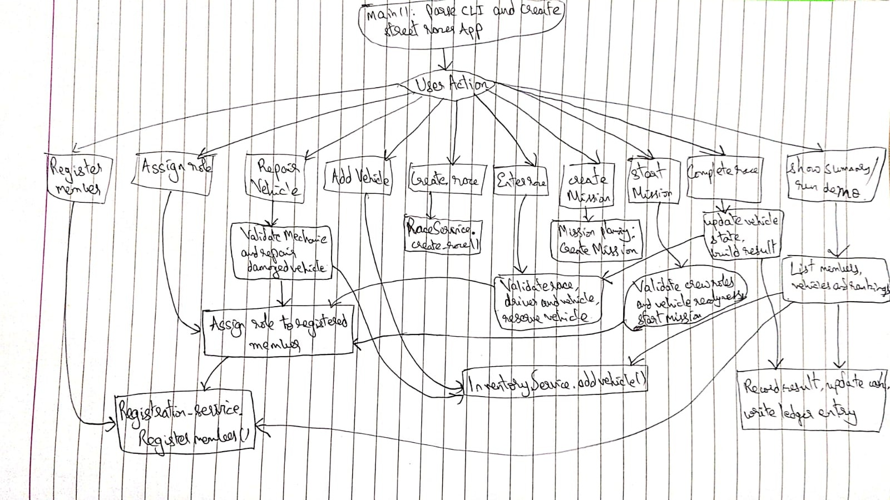

# Integration Testing Report

## 2. System Overview

For Part 2, a command-line system called `StreetRace Manager` was implemented in Python under `integration/code/`. The system was organized as separate service modules with shared in-memory data models so that module interactions remained explicit and testable.

The final implementation included all required modules:
- Registration
- Crew Management
- Inventory
- Race Management
- Results
- Mission Planning

It also included two extra modules:
- Garage
- Ledger

The Garage module was added to manage vehicle damage, repairs, and availability. The Ledger module was added to record money movements such as race prize payouts. These modules improved both rule enforcement and integration-test clarity.

## 2.1 Call Graph

The handwritten call graph was drawn from the implemented CLI and application flow. It showed how user commands passed through the application facade into the registration, crew, inventory, race, results, mission, garage, and ledger modules.

<div class="diagram-block">
  <p><strong>StreetRace Manager Call Graph</strong></p>
  
</div>

The most important calls represented in the graph were:
- `main()`
- `run_cli_session()`
- `StreetRaceApp.register_member()`
- `StreetRaceApp.assign_role()`
- `StreetRaceApp.add_vehicle()`
- `StreetRaceApp.create_race()`
- `StreetRaceApp.enter_race()`
- `StreetRaceApp.complete_race()`
- `StreetRaceApp.create_mission()`
- `StreetRaceApp.start_mission()`
- `StreetRaceApp.repair_vehicle()`
- `StreetRaceApp.summary()`
- `RegistrationService.register_member()`
- `CrewService.assign_role()`
- `InventoryService.add_vehicle()`
- `RaceService.create_race()`
- `RaceService.enter_driver()`
- `RaceService.complete_race()`
- `ResultsService.record_result()`
- `MissionPlanningService.create_mission()`
- `MissionPlanningService.start_mission()`
- `GarageService.mark_damaged()`
- `GarageService.repair_vehicle()`
- `LedgerService.record_entry()`

## 2.2 Business Rules Enforced

The system enforced the following integration rules:
- a crew member had to be registered before a role could be assigned
- only crew members with the `driver` role could be entered into a race
- a race entry required a valid and available vehicle
- a vehicle already reserved for one race could not be entered into another until the first race completed
- a driver already committed to a ready race could not be entered into a second ready race
- completed races were terminal and could not be re-entered or completed again
- race completion required a finishing position of at least `1`
- if a car was damaged, it could not be used again until repaired
- repairs required a crew member with the `mechanic` role
- healthy vehicles could not be repaired as a silent no-op
- race results updated rankings and the Inventory cash balance
- prize payouts were recorded in the Ledger
- missions could not start if required roles were unavailable
- repeated required roles had to be backed by enough matching crew members
- a mission could not be started repeatedly once it was already active
- malformed CLI damage flags were rejected instead of being silently interpreted as `False`

These rules were implemented in code and verified through integration tests.

## 2.3 Integration Test Cases

### Test Case 1: Register a crew member and assign a role
- Scenario: a new member was registered and then assigned the `driver` role with a skill level.
- Modules involved: Registration, Crew Management.
- Expected result: the role and skill level were updated successfully.
- Actual result: the flow worked as expected.
- Why needed: it verified that role management depended on successful registration.

### Test Case 2: Reject role assignment for an unknown member
- Scenario: a role assignment was attempted for an ID that had never been registered.
- Modules involved: Crew Management, Registration.
- Expected result: the system failed with an explicit error.
- Actual result: the flow worked as expected, raising `ValueError`.
- Why needed: it checked the dependency between crew management and registration data.

### Test Case 3: Add a vehicle and repair it through the garage
- Scenario: a vehicle was added, marked damaged, and then repaired using a mechanic.
- Modules involved: Inventory, Garage, Registration, Crew Management.
- Expected result: the vehicle became unavailable when damaged and available again after repair.
- Actual result: the flow worked as expected.
- Why needed: it verified vehicle-state flow across multiple modules.

### Test Case 4: Reject repairs by a non-mechanic
- Scenario: a repair was attempted using a crew member with the `driver` role.
- Modules involved: Garage, Crew Management, Registration.
- Expected result: repair failed with an explicit error.
- Actual result: the flow worked as expected, raising `ValueError`.
- Why needed: it verified role-sensitive integration logic.

### Test Case 5: Register a driver and complete a race
- Scenario: a driver was registered, a vehicle was added, a race was created, the race was entered, and the result was recorded.
- Modules involved: Registration, Crew Management, Inventory, Race Management, Results, Ledger.
- Expected result: rankings were updated, Inventory cash increased, and Ledger stored a prize entry.
- Actual result: the flow worked as expected.
- Why needed: it covered the main end-to-end success path required by the assignment.

### Test Case 6: Attempt race entry with an unregistered member
- Scenario: race entry was attempted using an unknown crew-member ID.
- Modules involved: Race Management, Registration.
- Expected result: the system failed with an explicit error.
- Actual result: the flow worked as expected, raising `ValueError`.
- Why needed: it checked that race entry depended on valid registration.

### Test Case 7: Attempt race entry with a non-driver
- Scenario: a crew member was registered as `strategist` and then used for race entry.
- Modules involved: Registration, Crew Management, Race Management.
- Expected result: the entry was rejected.
- Actual result: the flow worked as expected, raising `ValueError`.
- Why needed: it checked role validation in race management.

### Test Case 8: Reject damaged vehicles during race entry
- Scenario: a vehicle was damaged first and then entered into a race.
- Modules involved: Inventory, Garage, Race Management.
- Expected result: race entry failed because the vehicle was unavailable.
- Actual result: the flow worked as expected, raising `ValueError`.
- Why needed: it validated the interaction between garage state and race entry.

### Test Case 9: Rankings should sort correctly after multiple races
- Scenario: race results were recorded for two different drivers with different finishing positions.
- Modules involved: Registration, Crew Management, Inventory, Race Management, Results.
- Expected result: the higher-scoring driver appeared first in rankings.
- Actual result: the flow worked as expected.
- Why needed: it verified repeated interaction between races and result aggregation.

### Test Case 10: Mission cannot start when a required role is missing
- Scenario: a mission required `driver` and `mechanic` when neither role was available.
- Modules involved: Mission Planning, Crew Management.
- Expected result: mission start failed immediately.
- Actual result: the flow worked as expected, raising `ValueError`.
- Why needed: it verified precondition checking for missions.

### Test Case 11: Damaged vehicle blocks a mission until repaired
- Scenario: a vehicle was damaged in a race, then a mission that depended on that vehicle was started, repaired, and retried.
- Modules involved: Race Management, Results, Garage, Mission Planning, Crew Management.
- Expected result: the first mission start failed and the second succeeded after repair.
- Actual result: the flow worked as expected.
- Why needed: it tested a cross-module flow explicitly described in the assignment.

### Test Case 12: App facade summary reports global system state
- Scenario: a complete high-level flow was executed through the `StreetRaceApp` facade and then summarized.
- Modules involved: App facade, Registration, Crew Management, Inventory, Race Management, Results.
- Expected result: the summary showed correct cash balance, member count, vehicle count, and rankings.
- Actual result: the flow worked as expected.
- Why needed: it verified that the CLI-facing orchestration layer was correctly connected to the underlying services.

### Test Case 13: Interactive CLI session supports a full end-to-end workflow
- Scenario: one CLI session was used to register a member, assign a role, add a vehicle, create and complete a race, and request a summary.
- Modules involved: CLI, App facade, Registration, Crew Management, Inventory, Race Management, Results.
- Expected result: the command-line session preserved in-memory state and completed the full workflow in one process.
- Actual result: the flow worked as expected after the interactive session loop was added.
- Why needed: it proved that the submitted terminal interface could actually drive the system end to end.

### Test Case 14: Prevent double-booking the same vehicle into multiple races
- Scenario: one vehicle was entered into a race and then entered into a second race before the first finished.
- Modules involved: Inventory, Garage, Race Management.
- Expected result: the second entry failed until the first race completed and released the vehicle.
- Actual result: the flow worked as expected.
- Why needed: it enforced the assignment rule that only available vehicles could be used.

### Test Case 15: Completed races are terminal
- Scenario: a race was completed and then entered again or completed a second time.
- Modules involved: Race Management, Results.
- Expected result: both operations failed with explicit errors.
- Actual result: the flow worked as expected after race-state guards were added.
- Why needed: it prevented duplicate payouts and duplicate ranking updates.

### Test Case 16: Reject repairs for healthy vehicles
- Scenario: a repair was attempted on a vehicle that had never been damaged.
- Modules involved: Garage, Inventory.
- Expected result: the repair failed with an explicit error.
- Actual result: the flow worked as expected after the damage-state guard was added.
- Why needed: it prevented silent no-op repair workflows.

### Test Case 17: Mission role validation counts duplicate requirements
- Scenario: a mission required two drivers but only one was registered.
- Modules involved: Mission Planning, Crew Management, Registration.
- Expected result: mission start failed because the crew roster did not satisfy both driver slots.
- Actual result: the flow worked as expected after validation was changed from role presence to counted role slots.
- Why needed: it verified that repeated role requirements were enforced correctly.

### Test Case 18: A driver cannot be entered into two ready races
- Scenario: the same driver was entered into one ready race and then reused in a second ready race with a different vehicle.
- Modules involved: Registration, Crew Management, Race Management, Inventory.
- Expected result: the second entry failed with an explicit error.
- Actual result: the issue was detected during debugging and then corrected.
- Why needed: it prevented a single driver from being double-booked across concurrent races.

### Test Case 19: Race completion rejects impossible finishing positions
- Scenario: a race was completed with `position=0`.
- Modules involved: Race Management, Results.
- Expected result: the system failed fast with an explicit error.
- Actual result: the issue was detected during debugging and then corrected.
- Why needed: it prevented invalid standings data from being silently recorded.

### Test Case 20: A mission cannot be started twice
- Scenario: the same mission was started and then started again without any status transition in between.
- Modules involved: Mission Planning.
- Expected result: the second start failed with an explicit error.
- Actual result: the issue was detected during debugging and then corrected.
- Why needed: it prevented repeated activation of a mission that was already active.

### Test Case 21: The CLI rejects malformed damage flags
- Scenario: the interactive CLI received `complete-race race-1 1 maybe`.
- Modules involved: CLI, App facade, Race Management.
- Expected result: the CLI failed fast because `maybe` was not a valid boolean token.
- Actual result: the issue was detected during debugging and then corrected.
- Why needed: it prevented silent data corruption caused by malformed operator input.

## 2.4 Errors Or Issues Found

The integration section was built incrementally using test-first slices, and the following concrete issues were found and fixed:

1. `Error 1: Add interactive CLI session for end-to-end workflows`
   - Problem found: the CLI used one-shot subcommands only, so state was lost between invocations and the terminal interface could not drive the full workflow in one process.
   - Fix: an interactive session loop with command handlers for registration, role assignment, races, missions, repairs, and summaries was added.

2. `Error 2: Prevent vehicles from being double-booked`
   - Problem found: the same vehicle could be entered into multiple races simultaneously because availability only checked damage, not reservation state.
   - Fix: reservation state was added to vehicles and reserve/release behavior was enforced in inventory and race handling.

3. `Error 3: Make completed races terminal`
   - Problem found: completed races could be re-entered and completed again, causing repeated prize payouts and ranking updates.
   - Fix: the race lifecycle was enforced so only `planned` races accepted entries and only `ready` races could be completed.

4. `Error 4: Reject repairs for healthy vehicles`
   - Problem found: garage repairs silently succeeded even when the vehicle was not damaged.
   - Fix: an explicit guard was added that rejected no-op repairs.

5. `Error 5: Count duplicate role requirements in missions`
   - Problem found: mission validation only checked role presence, so one driver incorrectly satisfied `['driver', 'driver']`.
   - Fix: mission validation was changed to counted role slots using role-frequency checks.

6. `Error 6: Prevent one driver from entering two ready races`
   - Problem found: race entry enforced vehicle exclusivity but did not enforce driver exclusivity, so one driver could be committed to multiple ready races simultaneously.
   - Fix: active-race checks for the selected driver were added before a new race entry was accepted.

7. `Error 7: Reject impossible race positions`
   - Problem found: `position=0` and other non-positive finishing positions were accepted and converted into ranking points.
   - Fix: race completion was changed to fail fast unless the finishing position was at least `1`.

8. `Error 8: Reject repeated mission activation`
   - Problem found: a mission that was already active could be started again without any error.
   - Fix: mission start was guarded so only `planned` missions could transition to `active`.

9. `Error 9: Reject malformed CLI damage flags`
   - Problem found: the CLI treated any token other than `true` as `False`, which silently changed race-damage state on bad input.
   - Fix: CLI parsing was changed to accept only `true` or `false` and to raise `ValueError` otherwise.

10. `Error 10: Remove manual PYTHONPATH dependency from integration tests`
   - Problem found: the test suite failed from the repo root unless `PYTHONPATH=integration/code` was provided manually.
   - Fix: `integration/tests/conftest.py` was added to insert `integration/code` into `sys.path` during test collection.

The only repository-level issue encountered during development was accidental generation of Python cache files under `integration/`. Those generated files were removed and not left as part of the intended submission content.

## 2.5 Verification

The implementation was verified using:

```bash
pytest integration/tests -q
```

Final result:

```text
21 passed in 0.03s
```

Manual CLI verification was also performed with:

```bash
PYTHONPATH='integration/code' .venv/bin/python integration/code/main.py demo
```

This produced a valid JSON summary showing:
- 1 registered member
- 1 vehicle
- updated cash balance
- updated rankings

## 2.6 Summary

The final StreetRace Manager system satisfied the required module list, included two extra modules, and enforced the main business rules through module interaction rather than isolated logic. The final integration suite covered success flows, failure flows, the interactive CLI workflow, race entry validation, driver and vehicle exclusivity, vehicle damage and repair, prize-money updates, rankings, and mission-role validation.
