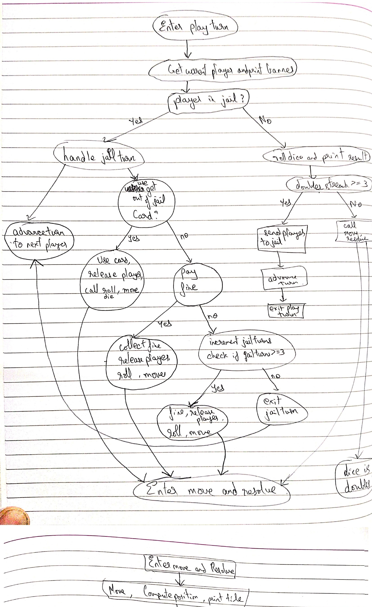
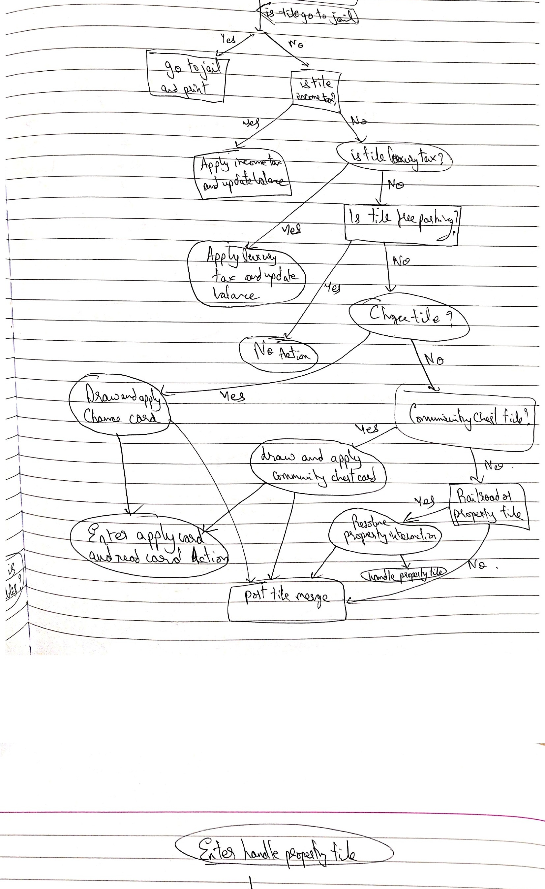
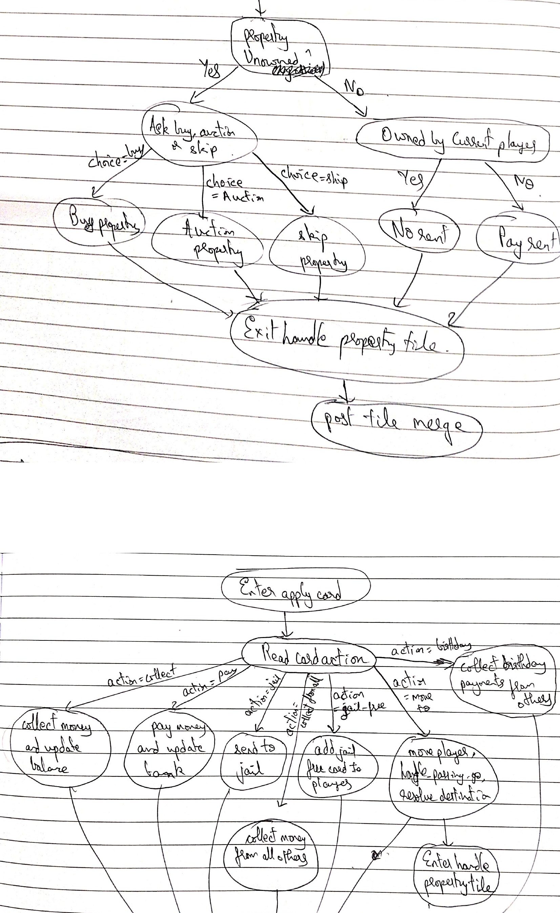
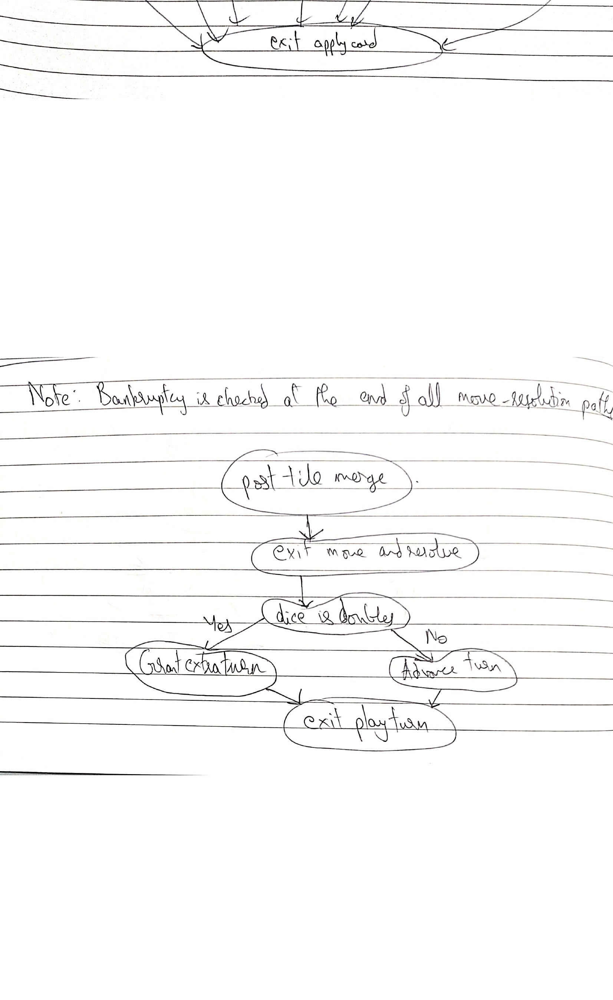

# White Box Report

## 1.1 Control Flow Graph

The control flow graph was derived from the principal execution path of the MoneyPoly program. The graph started at `main()`, where player names were collected and the `Game` object was created, and then followed the main gameplay flow through `Game.run()`, `play_turn()`, and `_move_and_resolve()`. The branches inside `_handle_jail_turn()`, `_apply_card()`, and `_handle_property_tile()` were expanded because those functions contained the most important decisions, state changes, and branch paths in the game.

To keep the handwritten CFG readable, sequential statements were grouped into related blocks and repeated post-branch flows were merged into common nodes while preserving the real control structure. The submitted diagram was created from the actual code and labeled with clear node and edge names.

Because the handwritten CFG was taller than a single report page, it was embedded below as four ordered slices so that the complete diagram remained readable in the PDF.

<div class="diagram-block whitebox-diagram">
  <p><strong>MoneyPoly CFG - Part 1</strong></p>
  
</div>

<div class="diagram-block whitebox-diagram">
  <p><strong>MoneyPoly CFG - Part 2</strong></p>
  
</div>

<div class="diagram-block whitebox-diagram">
  <p><strong>MoneyPoly CFG - Part 3</strong></p>
  
</div>

<div class="diagram-block whitebox-diagram">
  <p><strong>MoneyPoly CFG - Part 4</strong></p>
  
</div>

## 1.2 Code Quality Analysis

For this section, `pylint` was run against the copied MoneyPoly code placed under `whitebox/code/moneypoly/`. The cleanup was performed iteratively and each step was saved as a separate commit in the required `Iteration #:` format. The goal was to improve code quality without changing intended gameplay behavior unless refactoring was required to correct a structural problem.

### Tool Used

```bash
PYTHONPATH='whitebox/code/moneypoly' .venv/bin/pylint whitebox/code/moneypoly/main.py whitebox/code/moneypoly/moneypoly/*.py
```

### Iterative Changes

1. `Iteration 1: Add MoneyPoly code to whitebox working tree`
   - The MoneyPoly source was copied into `whitebox/code/moneypoly/` so the white-box deliverable matched the required assignment structure.

2. `Iteration 2: Remove unused imports and tidy lint hygiene`
   - Unused imports were removed from `bank.py`, `dice.py`, `game.py`, and `player.py`.
   - One unused local variable was removed from `player.py`.
   - Missing final newlines were added.

3. `Iteration 3: Fix direct pylint style and exception warnings`
   - A singleton comparison in `board.py` was corrected.
   - A bare `except` in `ui.py` was replaced with `except ValueError`.
   - An unnecessary `else` structure in `property.py` was removed.
   - Several direct style warnings in `game.py` were corrected.
   - `doubles_streak` was initialized inside `Dice.__init__()`.

4. `Iteration 4: Add missing module and function docstrings`
   - Missing module docstrings were added across the package.
   - Missing function docstrings were added in `main.py`.
   - Missing class docstrings were added where required.

5. `Iteration 5: Reformat card definitions for pylint compliance`
   - The Chance and Community Chest card data in `cards.py` were reformatted to remove line-length violations while preserving the same values.

6. `Iteration 6: Refactor card handling to reduce branch complexity`
   - `Game._apply_card()` was refactored into smaller helpers with dispatch-based handling.
   - The card logic became easier to read and maintain, and the branch complexity was reduced.

7. `Iteration 7: Resolve remaining pylint structural warnings`
   - Targeted suppressions were added only for remaining domain-model-heavy structural warnings after direct cleanup and refactoring had already been completed.

### Final Result

After all iterations, the final pylint run reported:

```text
Your code has been rated at 10.00/10
```

### Summary

The code quality analysis improved the MoneyPoly codebase through multiple small commits instead of one large cleanup. The major improvements included removal of unused code, better exception handling, improved documentation, cleaner formatting, and a refactor of card-processing logic. The final white-box working copy under `whitebox/code/moneypoly/` achieved a pylint score of `10.00/10`.

## 1.3 White Box Test Cases

For the white-box testing section, tests were designed directly from the control flow of the main gameplay logic. The goal was to cover important decisions, key state changes, and relevant edge cases rather than only surface-level outputs. The tests were written under `whitebox/tests/` and followed an iterative red-green-fix approach: a focused failing test was written first, the root cause was identified next, and the smallest correct code fix was then applied.

### Why These Tests Were Needed

The MoneyPoly code contained several decision-heavy paths:
- dice rolling and doubles handling
- winner selection
- movement across the board and passing Go
- property purchases, rent, mortgages, and trades
- jail behavior
- card-deck actions
- bankruptcy and cleanup

These areas were selected because they directly influenced game state and could easily hide logical mistakes. The tests were also aligned with the CFG created in Section 1.1, especially the branches inside `play_turn()`, `_move_and_resolve()`, `_handle_jail_turn()`, `_apply_card()`, and `_handle_property_tile()`.

### Errors Found And Fixed

1. `Error 1: Fix dice roll range and add white-box test`
   - Problem found: dice rolls used `randint(1, 5)` instead of a six-sided range.
   - Why the test was needed: dice values controlled movement and doubles logic, so the wrong range affected many downstream branches.
   - Fix: the dice roll range was corrected to `1..6`.

2. `Error 2: Fix winner selection to use highest net worth`
   - Problem found: `find_winner()` returned the player with minimum net worth.
   - Why the test was needed: final winner calculation was a core program outcome.
   - Fix: winner selection was changed from `min(...)` to `max(...)`.

3. `Error 3: Award Go salary when passing the board start`
   - Problem found: Go salary was awarded only when landing exactly on position `0`, not when passing it.
   - Why the test was needed: movement across the board was a key state transition and passing Go was a required edge case.
   - Fix: movement logic was updated to detect wrap-around and award salary.

4. `Error 4: Allow property purchase with exact balance`
   - Problem found: players could not buy a property if their balance exactly matched the price.
   - Why the test was needed: exact-boundary values were explicitly required edge cases.
   - Fix: the affordability check was changed from `<=` to `<`.

5. `Error 5: Credit rent payments to the property owner`
   - Problem found: rent was deducted from the tenant but not credited to the owner.
   - Why the test was needed: this was a direct money-transfer path between players.
   - Fix: the owner balance update was added in `pay_rent()`.

6. `Error 6: Require full group ownership before doubling rent`
   - Problem found: rent was doubled when the owner had only one property in the group.
   - Why the test was needed: rent calculation depended on key variable state, especially group ownership.
   - Fix: the ownership check was changed from `any(...)` to `all(...)`.

7. `Error 7: Deduct player balance when paying jail fine`
   - Problem found: voluntarily paying the jail fine released the player but did not deduct money.
   - Why the test was needed: jail handling contained several important branches with financial effects.
   - Fix: the fine was deducted before release.

8. `Error 8: Guard empty card decks against zero-division`
   - Problem found: `cards_remaining()` and `__repr__()` failed for an empty deck.
   - Why the test was needed: empty-container edge cases were relevant white-box scenarios.
   - Fix: explicit empty-deck guards were added.

9. `Error 9: Transfer cash to seller during property trades`
   - Problem found: the buyer paid cash, ownership changed, but the seller did not receive the money.
   - Why the test was needed: property trade was a multi-state transaction and required direct money-flow verification.
   - Fix: the seller was credited during successful trades.

10. `Error 10: Preserve mortgage state on failed unmortgage`
   - Problem found: if the player could not afford the unmortgage cost, the property still became unmortgaged.
   - Why the test was needed: this was an order-of-operations bug caused by state mutation before validation.
   - Fix: the state change was delayed until after the affordability check.

11. `Error 11: Reduce bank funds when issuing loans`
   - Problem found: loans increased the player balance but did not reduce bank funds.
   - Why the test was needed: bank and player state needed to remain consistent after loan issuance.
   - Fix: bank funds were debited when the loan was issued.

12. `Error 12: Enforce minimum player count in game setup`
   - Problem found: the prompt required at least two players, but `Game()` still accepted zero or one player.
   - Why the test was needed: setup validation was part of the documented program contract.
   - Fix: a `ValueError` guard was added in `Game.__init__()` when fewer than two player names were provided.

13. `Error 13: Preserve turn order after player elimination`
   - Problem found: if the current player went bankrupt during their turn, `play_turn()` still advanced the index and could skip the next active player or print a doubles retry message for an eliminated player.
   - Why the test was needed: bankruptcy cleanup changed the player list during active control flow, which made turn-order handling a high-risk white-box branch.
   - Fix: `_check_bankruptcy()` index handling was corrected and `play_turn()` was short-circuited when the active player was eliminated mid-turn.

14. `Error 14: Include owned assets in net worth`
   - Problem found: `Player.net_worth()` returned only cash balance and ignored owned properties.
   - Why the test was needed: `net_worth()` was used by both the UI and final winner logic, so incorrect asset valuation affected multiple outcomes.
   - Fix: owned property value was included, with mortgaged properties counted at mortgage value.

15. `Error 15: Expose pre-roll actions in the main turn flow`
   - Problem found: the interactive mortgage / trade / loan menu existed but was never called from `play_turn()`.
   - Why the test was needed: white-box analysis exposed dead control-flow branches that were implemented but unreachable.
   - Fix: the pre-roll menu call was inserted into the normal non-jail turn path before the dice roll.

16. `Error 16: Use real bank payouts for mortgages`
   - Problem found: mortgage payouts were implemented as `bank.collect(-amount)`, which corrupted bank accounting.
   - Why the test was needed: mortgage handling was a money-transfer path and needed consistent internal accounting.
   - Fix: mortgage payouts were changed to use `Bank.pay_out()`.

17. `Error 17: Prevent emergency loans from overdrawing the bank`
   - Problem found: emergency loans could exceed bank reserves and drive the bank balance negative.
   - Why the test was needed: invalid financial states were required to fail fast.
   - Fix: loan issuance was routed through `Bank.pay_out()` so oversized loans raised `ValueError`.

18. `Error 18: Keep mortgage transactions atomic on bank failure`
   - Problem found: mortgage processing set `prop.is_mortgaged = True` before confirming that the bank could fund the payout.
   - Why the test was needed: failed payouts should not leave half-applied transactions behind.
   - Fix: the bank payout check was moved ahead of the mortgage-state mutation.

19. `Error 19: Reject negative bank collections`
   - Problem found: `Bank.collect(-amount)` reduced both reserves and `total_collected`.
   - Why the test was needed: negative collection was an invalid financial input and should not silently mutate state.
   - Fix: `Bank.collect()` was changed to raise `ValueError` for negative amounts.

20. `Error 20: Exclude railroads from special-tile helper`
   - Problem found: `Board.is_special_tile()` returned `True` for railroad squares even though the helper described only non-property special tiles.
   - Why the test was needed: helper semantics mattered for white-box reasoning and needed to match the documented method meaning.
   - Fix: `is_special_tile()` was narrowed so it excluded railroads while still returning `True` for real special tiles such as chance, jail, and taxes.

### Additional Branch Coverage Added

After the detected errors were fixed, additional white-box tests were added to cover important branches that already behaved correctly:
- card action branches
- property tile decision branches
- jail-turn branches
- special tile resolution branches
- mortgage, auction, and bankruptcy branches
- play-turn doubles and triple-doubles branches
- board, player, bank, and card-deck helper behavior
- failure paths where properties or tiles resolved to missing objects

These additional tests were committed incrementally as `Test 1` through `Test 15`, so the final suite reflected both bug-finding tests and branch-expansion tests.

### Verification

The final white-box test suite was verified with:

```bash
PYTHONPATH='whitebox/code/moneypoly' .venv/bin/pytest whitebox/tests -q
```

Final result:

```text
84 passed in 0.05s
```

### Summary

The white-box testing process found logical issues in movement, winner selection, setup validation, turn-order handling after bankruptcy, property transactions, helper semantics, jail handling, card-deck edge cases, bank accounting, and trade flow. Each detected error was fixed through a separate small commit, and the final suite covered a broad set of branches, variable states, helper behaviors, and edge cases derived from the control flow graph. The final submission therefore included `Error 1` through `Error 20` commits for defect correction and `Test 1` through `Test 15` commits for branch and edge-case expansion.
